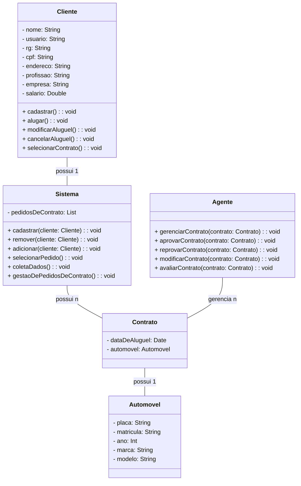
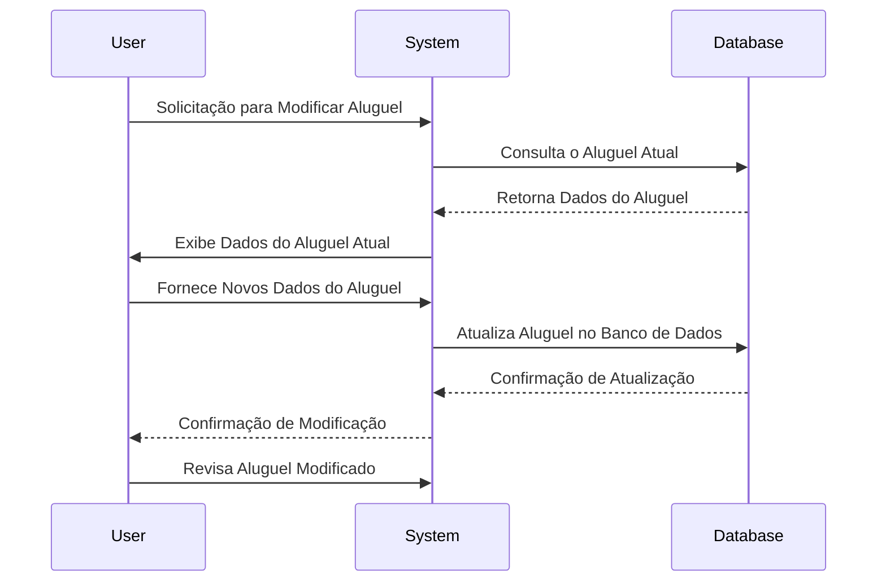
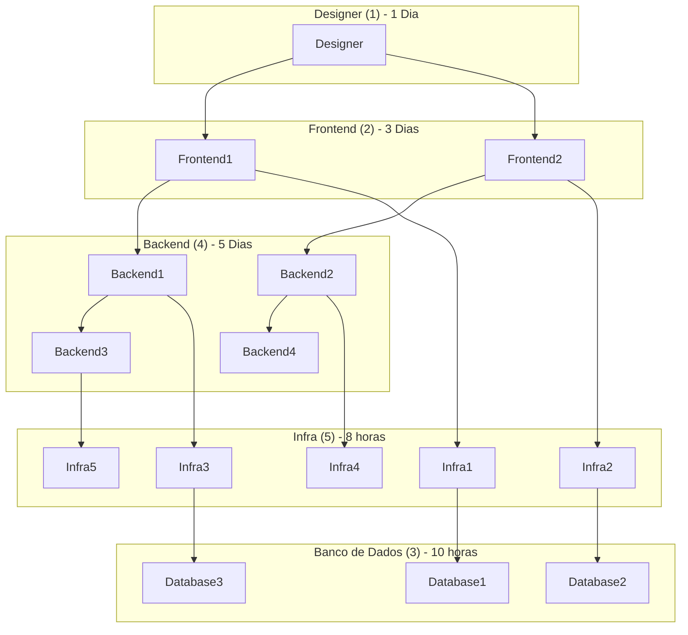

# Diagrama-de-classe-umc

```mermaid
classDiagram
  class Cliente {
    - nome: String
    - usuario: String
    - rg: String
    - cpf: String
    - endereco: String
    - profissao: String
    - empresa: String
    - salario: Double
    + cadastrar(): void
    + alugar(): void
    + modificarAluguel(): void
    + cancelarAluguel(): void
    + selecionarContrato(): void
  }

  class Sistema {
    - pedidosDeContrato: List<Contrato>
    + cadastrar(cliente: Cliente): void
    + remover(cliente: Cliente): void
    + adicionar(cliente: Cliente): void
    + selecionarPedido(): void
    + coletaDados(): void
    + gestaoDePedidosDeContrato(): void
  }

  class Contrato {
    - dataDeAluguel: Date
    - automovel: Automovel
  }

  class Automovel {
    - placa: String
    - matricula: String
    - ano: Int
    - marca: String
    - modelo: String
  }

  class Agente {
    + gerenciarContrato(contrato: Contrato): void
    + aprovarContrato(contrato: Contrato): void
    + reprovarContrato(contrato: Contrato): void
    + modificarContrato(contrato: Contrato): void
    + avaliarContrato(contrato: Contrato): void
  }

  Cliente -- Sistema: possui 1
  Sistema -- Contrato: possui n
  Agente -- Contrato: gerencia n
  Contrato -- Automovel: possui 1
```

```mermaid
sequenceDiagram
    participant User
    participant System
    participant Database

    User->>System: Solicitação para Modificar Aluguel
    System->>Database: Consulta o Aluguel Atual
    Database-->>System: Retorna Dados do Aluguel
    System->>User: Exibe Dados do Aluguel Atual

    User->>System: Fornece Novos Dados do Aluguel
    System->>Database: Atualiza Aluguel no Banco de Dados
    Database-->>System: Confirmação de Atualização
    System-->>User: Confirmação de Modificação

    User->>System: Revisa Aluguel Modificado

```

# Digrama de redes

```mermaid
graph TD;
    subgraph "Designer (1) - 1 Dia"
        A[Designer]
    end

    subgraph "Frontend (2) - 3 Dias "
        B[Frontend1]
        C[Frontend2]
    end

    subgraph "Backend (4) -  5 Dias"
        D[Backend1]
        E[Backend2]
        F[Backend3]
        G[Backend4]
    end

    subgraph "Infra (5) - 8 horas"
        H[Infra1]
        I[Infra2]
        J[Infra3]
        K[Infra4]
        L[Infra5]
    end

    subgraph "Banco de Dados (3) - 10 horas"
        M[Database1]
        N[Database2]
        O[Database3]
    end

    A --> B
    A --> C
    B --> D
    C --> E
    D --> F
    E --> G
    B --> H
    C --> I
    D --> J
    E --> K
    F --> L
    H --> M
    I --> N
    J --> O

```
